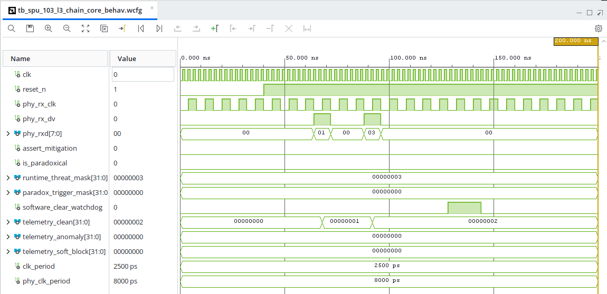

# REIO-Chain (SPU_103)

## Filtre Synchrone d'Interception Réseau & Disjoncteur Matériel (125 MHz / 400 MHz)

REIO-Chain (SPU_103) est un bloc de propriété intellectuelle (IP Core) matériel/logiciel ultra-compact conçu pour l'interception linéaire et le masquage déterministe de flux de données Couche 3 (Layer 3). L'architecture est scindée en un plan de filtrage physique asynchrone cadencé à 125 MHz et un plan de contrôle bare-metal supervisé à 400 MHz.

### 🔬 Performances Matérielles Certifiées (AMD/Xilinx Vivado v2026.1)

Les rapports d'implémentation post-placement-routage sur puce Xilinx Artix-7 (xc7a12tlcpg238-2L) certifient les métriques physiques suivantes :

- **Fréquence Horloge Système (Rust) :** 400 MHz (Période stricte de 2,5 ns)
- **Fréquence Horloge Ligne (Ethernet) :** 125 MHz (Période stricte de 8,0 ns)
- **Worst Negative Slack (WNS) :** +1,596 ns (Setup métrique parfait, zéro violation)
- **Total Negative Slack (TNS) :** 0,000 ns
- **Worst Pulse Width Slack (WPWS) :** +0,750 ns
- **Livrable Temporel :** Coupure réseau déterministe en 1 seul cycle machine

### 📊 Empreinte Géométrique & Signature Thermique

- **Slice LUTs :** 12 (0,15% du composant)
- **Slice Registers :** 111 (0,69% du composant)
- **Primitives Hardware :** 111 FDCE flip-flops, 24 blocs CARRY4
- **Puissance Électrique Totale :** 58 mW (Puissance dynamique active du cœur : 1 mW)
- **I/O Physiques :** Configuration d'entrées/sorties routées sous contrainte de délai LVCMOS33

### 🛠️ Architecture du Framework Unifié

1. **RTL Core (VHDL) :** Pipeline d'interception directe parallèle s'interfaçant avec un bus physique Ethernet. Intègre un bloc de protection contre les inversions d'états, un disjoncteur matériel à verrouillage et une matrice de Télémétrie Multi-Secteurs synchrone.
2. **Control Plane (Rust 2024) :** Pilote autonome s'exécutant sous contraintes strictes `![no_std]`, effectuant des lectures directes et volatiles par mappage mémoire MMIO, calculant les ratios de corruption en arithmétique entière fixe.
3. **Host Interface (C-FFI) :** Exportation des bindings via un en-tête C (`reio_chain.h`) exploitant des structures unifiées et alignées à 32 octets sur les lignes de cache CPU.

*Conformément aux clauses de propriété intellectuelle, les codes sources restent confidentiels. Les rapports de compilation CAO d'utilisation (`.rpt`), de puissance et les chronogrammes de simulation comportementale sont accessibles en Open-Core.*
