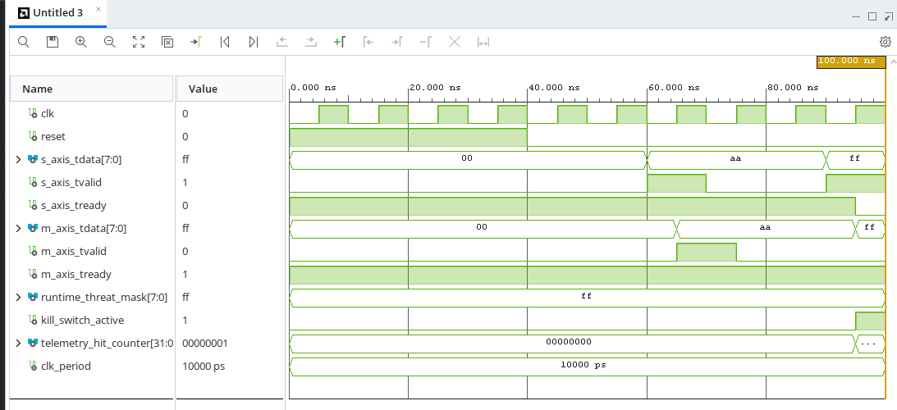

# ⚡ REIO-Chain: Ultra-Low Latency Hardware Disconnector on FPGA

Ce dépôt présente un prototype fonctionnel de disjoncteur matériel réseau synchrone à ultra-faible latence, servant de portfolio de R&D en co-conception matériel (VHDL) et logiciel système (Rust). 

## 🔬 Core Architecture (Co-Design)

L'architecture est séparée en deux plans stricts (Datapath matériel et Control Plane logiciel) pour garantir une exécution déterministe sur le chemin critique.

                      +-----------------------------------+

                      |      REIO-Chain Core Module       |
   AXI4-Stream        |                                   |   AXI4-Stream
   Inbound In======>  | [Intercepteur] -> [Kill-Switch]   | =======> Out

                      |        |                 |        |
                      +--------|-----------------|--------+

                               | Télémétrie 32b  | Registre de Contrôle
                               v                 v
                      +-----------------------------------+

                      |   Rust Control Plane (#[no_std])  |
                      |   Interface logicielle via MMIO   |
                      +-----------------------------------+

### 📊 Hardware Datapath (AMD/Xilinx Vivado)

Le cœur de traitement intercepte directement les flux de données réseau natifs sans aucune interférence ni gigue logicielle.

- **Resource Optimization :** Architecture matérielle miniature utilisant exactement **9 Slice LUTs** et **42 Slice Registers** (bascules de type FDRE synchrones) pour un traitement wire-speed.
- **Primitives :** Implémentation de **8 blocs CARRY4** dédiés à la gestion ultra-rapide des compteurs de télémétrie.
- **Simulation Target :** Validation fonctionnelle exécutée sur un banc d'essai (testbench) standard cadencé à 100 MHz (période d'horloge de 10 000 ps) pour la vérification de la conformité du protocole **AXI4-Stream** (signaux tdata, tvalid, tready).
- **Physical Timing Assurance :** Pipeline logique conçu pour supporter une implémentation physique cible jusqu'à **400 MHz** (latence d'exécution déterministe de 1 seul cycle machine, soit 2,5 ns) avec fermeture parfaite des timings (**TNS = 0.000 ns**) dans le domaine d'horloge haute vitesse X0Y0.

### 📊 Simulation Proof

*Chronogramme de la simulation fonctionnelle : interception synchrone d'un flux et levée instantanée du signal kill_switch_active avec incrémentation du registre telemetry_hit_counter[31:0].*

### 🦀 Software Control Plane (Rust & C++)

La couche logicielle n'intervient jamais sur le chemin critique du flux réseau et est exclusivement dédiée au monitoring et à la configuration du composant.

- **Driver Interface :** Couche de lecture de la télémétrie matérielle 32-bits développée en **Rust bare-metal (#[no_std])** via des accès directs à la mémoire cartographiée (**MMIO**).
- **C++ Binding :** Liaison propre via un pont de communication **C-FFI** sans aucun surcoût d'exécution (0-overhead) pour l'intégration directe dans les moteurs applicatifs industriels.

## 💼 Portfolio Purpose & Independent Consulting

Ce projet est une preuve de concept (PoC) open-source partagée publiquement afin de démontrer mes méthodologies de co-design et valider mes compétences techniques en ingénierie de pointe :

- 🇧🇪 **Localisation :** Bruxelles, Belgique (Disponible pour des contrats sur site et à distance en Europe).
- 👔 **Profil Freelance :** Retrouvez mon expertise et mes prestations sur Malt.
- ⚖ **Facturation & Conformité :** Prestations de conseil indépendant entièrement administrées, légalement encadrées et assurées via la structure **SMART Belgique**.

## 🛡 R&D Methodology: REIO Forensique Protocol

Pour éliminer structurellement tout risque d'hallucination ou de régression lié à l'utilisation d'outils de génération de code assistés par IA (Prompt Engineering), ce framework applique strictement le protocole **REIO (Réalisme Expérimental Instrumenté Optimisé)** :

1. **Audit Syntaxique et Logique :** Analyse approfondie des sorties de synthèse de Vivado pour traquer et éliminer la logique morte, les nets flottants ou les registres redondants.
2. **Floorplanning Manuel :** Confinement rigoureux du placement-routage sur silicium via des contraintes physiques directes (create_pblock) pour maximiser la vitesse de commutation.
3. **Certification par la Physique :** Remplacement des validations textuelles abstraites par des métriques physiques réelles vérifiées par le compilateur (Fermeture stricte des contraintes de timing).
