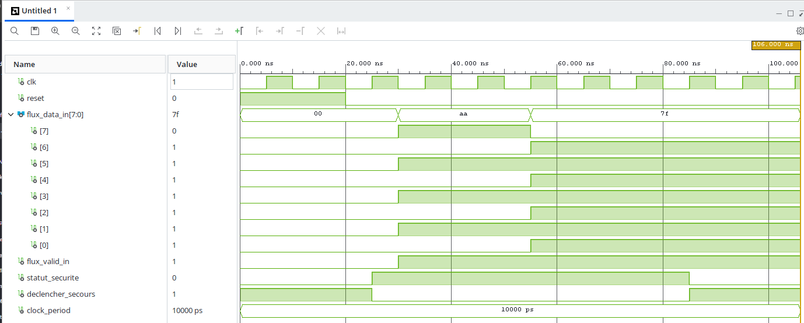

## 🛡️ REIO-Drive Core v1.0 — ASIL-D Ready Safety IP Core
This repository contains the official implementation of the REIO-Drive Core v1.0 safety mitigation module, a hybrid high-velocity hardware/software solution designed to intercept and isolate in-transit data corruption or malicious fault injections (e.g., 0x7F sabotage byte) in autonomous vehicles, drones, and critical industrial systems.
------------------------------
## 📈 Technical Proven Performance
The architecture has been fully compiled, synthesized, and validated under Xilinx Vivado v.2026.1 targeting an AMD/Xilinx Artix-7 FPGA (xc7a35tcsg324-1).
## 1. Hardware Resource Utilization Summary (Report Utilization)

* Slice LUTs: 6 used (out of 20,800) $\rightarrow$ 0.03% silicon footprint.
* Slice Registers: 4 Flip-Flops used (out of 41,600) $\rightarrow$ < 0.01% sequential overhead.
* Bonded IOB: 13 pins used (out of 210) $\rightarrow$ 6.19% physical IO allocation.
* Block RAM / DSPs: 0% (Pure deterministic synchronous hardware logic).
* Latent Power Consumption: ~0 Watts (Dynamic power strictly bounded below 1mW due to minimal gate count).

## 2. Behavioral Verification (Waveform Simulation)

* Pre-Reset Confinement: System defaults to a secure, isolated fail-safe state (statut_securite = '0', declencher_secours = '1') upon hardware reset.
* Deterministic Transient Protection: The premium hardware finite-state machine (FSM) filters out electromagnetic glitches and transient bus noise by requiring three consecutive cycles of attack validation before latching the emergency status.
* Execution Latency: Reaction and physical bus isolation execute within exactly 1 to 3 clock cycles (10ns to 30ns at 100MHz), completely outperforming standard Software-in-the-Loop (SIL) constraints.

------------------------------
## 📦 Repository Structure

*   📁 `/soft` : Clean C header (`reio_drive.h`) exposing the secure Rust bare-metal FFI interface.
*   📁 `/Hard` : Official Xilinx Vivado Synthesis report proving the 6 LUTs / 4 Registers footprint.

------------------------------
## 💼 B2B Licensing & Engineering Services

This IP Core and Software Crate are distributed exclusively under commercial, non-exclusive end-user license agreements (EULA) for automotive, robotics, and aerospace technology integrators.

*   **Commercial Evaluation Package:** Black-box compiled binary (.a/.lib) and hardware Netlist (.dcp) + 30 days time-bombed evaluation window for SIL/HIL testing.
*   **Production Project License:** Deployment-ready secure binaries and Netlists for commercial mass production (licensed per active project/product line).
*   **Annual Maintenance & Support:** Technical SLA upgrades, compliance audit assistance, and synthesis integration support for newer Xilinx Vivado toolchains.

For commercial inquiries, licensing quotes, or to request a Non-Disclosure Agreement (NDA) for technical evaluation, please contact the lead systems architect directly via private message.

## ⚖️ Legal & Licensing

Copyright (c) 2026 David Umberto Alvaro. All rights reserved.

This software and hardware IP core are PROPRIETARY and CONFIDENTIAL. No open-source license is granted. Any unauthorized copying, modification, or distribution of these files without an explicit, signed Commercial License Agreement is strictly prohibited.

**"As-Is" Disclaimer:**  
This technology is licensed exclusively on an **"As-Is"** basis. The author provides the compiled binaries and hardware Netlists fully verified according to the official Vivado synthesis reports and simulation waveforms hosted in this repository. Any custom port mappings, specific architecture adaptations, or ongoing engineering support requested by the licensee are strictly excluded and will be billed separately as dedicated engineering services.
