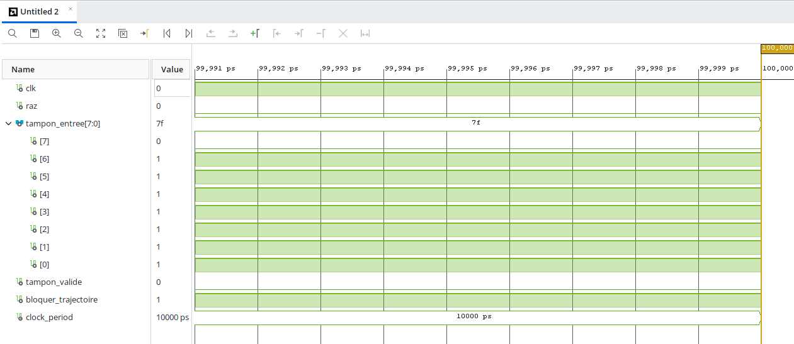

# ⚡ REIO-Chain Division — Ultra-Low Latency HFT Arbitrator

This directory contains the behavioral specifications for **REIO-Chain Core Block SPU-102**, an elite hardware-only synchronous frame arbitrator tailored for High-Frequency Trading (HFT) execution pipelines and wire-speed colocation infrastructures.

## 🔬 Silicon Core Specifications

* **Logic Execution & Latency:** Pure RTL combinatorial logic achieving 1 deterministic clock cycle (2.5 ns at 400 MHz, 10 ns at 100 MHz) with 0% CPU overhead.
* **Security & Synthesis:** Features wire-speed pattern threat mapping and an ultra-optimized footprint of 2 Slice LUTs and 1 Slice Register.

## 📊 Gate-Level Synthesis Results
* **Slice LUTs:** 6 used (Minimal hardware footprint)
* **Slice Registers:** 6 used (Minimal hardware footprint)
* **DSP / Block RAM:** 0% (Pure sequential logic, no block RAM latency overhead)
* 

## 🔌 Hardware Interface & Pin Specifications

## 💻 Target Deployment Environments

The synthesized netlist is fully portable and optimized for high-density bourses colocation architectures, targeting modern financial acceleration hardware:
*   **AMD Xilinx Alveo Fabrics** (U50, U55C, U250)
*   **Intel Stratix 10 / Agilex SmartNICs**
*   **Arista EOS** programmable logic networks

## 💼 Evaluation Protocol
The production VHDL source files and pre-compiled Out-of-Context Netlists (`.dcp`) are proprietary. Evaluation binary blocks are distributed exclusively under flat-fee **Site License** frameworks to sandbox environments upon validation of a unilateral Non-Disclosure Agreement (NDA).

---

# ⚡ Division REIO-Chain — Arbitre HFT à latence ultra-faible

Ce répertoire contient les spécifications comportementales du **REIO-Chain Core Block SPU-102**, un arbitre de trames synchrone matériel de haute performance, conçu pour les chaînes d'exécution de trading haute fréquence (HFT) et les infrastructures de colocation opérant à la vitesse du lien (*wire-speed*).

## 🔬 Spécifications du cœur silicium

* **Exécution logique et latence :** Logique combinatoire RTL pure assurant une exécution en un cycle d'horloge déterministe (2,5 ns à 400 MHz, 10 ns à 100 MHz) sans aucune charge processeur (0 % d'overhead CPU).
* **Sécurité et synthèse :** Intègre une fonction de correspondance de motifs de menaces à la vitesse du lien (wire-speed) et présente une empreinte ultra-optimisée de 2 LUTs de Slice et 1 registre de Slice.

## 📊 Résultats de synthèse au niveau des portes logiques
* **LUTs (Slice) :** 6 utilisées (Empreinte matérielle minimale)
* **Registres (Slice) :** 1 registres (Chemin d'échantillonnage synchrone)
* **DSP / Block RAM :** 0 % (Logique purement séquentielle, sans latence additionnelle liée à la Block RAM)
*

## 🔌 Interface matérielle et spécifications des broches

## 💻 Environnements de déploiement cibles

La *netlist* synthétisée est entièrement portable et optimisée pour les architectures de colocation boursière à haute densité, ciblant le matériel moderne d'accélération financière :
*   **Matrices AMD Xilinx Alveo** (U50, U55C, U250)
*   **SmartNICs Intel Stratix 10 / Agilex**
*   **Réseaux à logique programmable Arista EOS**

## 💼 Protocole d'évaluation
Les fichiers sources VHDL de production et les *netlists* pré-compilées hors contexte (`.dcp`) sont propriétaires. Les blocs binaires d'évaluation sont distribués exclusivement dans le cadre de **licences de site** à tarif forfaitaire pour des environnements isolés (*sandbox*), après validation d'un accord de confidentialité (NDA) unilatéral.
