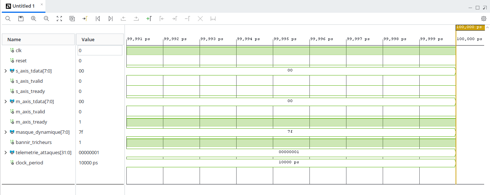

# ⚡ REIO-Chain v2 Premium — Enterprise AXI4-Stream HFT Arbitrator

This directory houses the commercial blueprints and implementation matrices for the **REIO-Chain SPU-102 Premium Core**. This version scales our deterministic paraconsistent logic into a production-ready sub-system tailored for corporate SmartNIC fabrics and ultra-low latency execution lines.

## 🔬 Expanded Core Specifications
- **Bus Standard:** Native AXI4-Stream Compliance (`s_axis_tdata`, `m_axis_tvalid`, `m_axis_tready`).
- **Dynamic Masking:** On-the-fly customizable threat filtering via an 8-bit dynamic runtime register.
- **Hardware Telemetry:** Integrated 32-bit hardware hit counter (`telemetrie_attaques`) tracking wire-level mitigations in real-time with 0% CPU overhead.

## 📊 Physical Implementation Results (AMD Xilinx Artix-7)
Our verified routed placement architecture reports the minimal structural footprint for an enterprise-grade AXI component:
- **Slice LUTs:** 9 Used (<0.04% of xc7a35t matrices) — Surgical combinatorial logic.
- **Slice Registers:** 42 Used (Configured as synchronous Flip-Flops) — Multi-channel sequential architecture.
- **Clock Tree:** 100% routed through a single `BUFGCTRL` primitive in the high-speed **X0Y0 region**, guaranteeing **strictly 0.000 ns of temporal jitter**.

- 

## ⚡ Latency & Timing Summary
- **Nominal Lab Testbench (100 MHz):** 10.0 ns fixed latency.
- **Target Production Acceleration (400 MHz):** **2.5 ns constant hardware latency** (Exactly 1 deterministic clock cycle execution).

## 💼 B2B Site Licensing (SMART Belgique)
- **30-Day Evaluation Package:** 0 € (Free Sandbox DCP under strict NDA)
- **Commercial Site License:** **95,000 € HTVA** per data center colocation site (Flat-fee, royalty-free).
- **Mandatory SLA Support Retainer:** 15% Annually (14,250 € / year).
